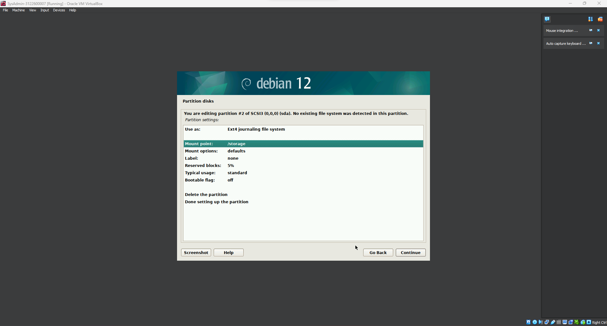

```
{
    Nama    : Agung Dwi Nugroho
    NRP     : 3122600006
    Kelas   : 2 STr IT A
}
```

# Instalasi Debian Menggunakan VirtualBox

### Setup Oracle VM VirtualBox
**1. Main Screen**<br>
<br>
Untuk menambahkan machine baru, klik pada new yang terletak di main screen virtualbox.
<br>
**2. Nama VM dan OS**<br>
<br>
Akan muncul screen untuk mengatur nama machine dan image dari OS yang akan digunakan. Sesuai penugasan, nama dari machine adalah 'SysAdmin-NRP'. Selain itu, saya menyimpan machine ini di direktori `D:\VM\Deb` dan menggunakan image Debian 12 yang terdapat pada direktori `D:\Downloads\`. Pastikan mencentang checkbox *skip unanttended installation* supaya dapat melakukan setup Debian secara manual nantinya.
<br>
**3. Hardware Spec**<br>
<br>
Setelah setup VM dan OS adalah alokasi spesifikasi hardware yg digunakan. Saya menggunakan 4 GB memori dan 2 Core CPU.
<br>
**4. Storage**<br>
<br>
Selanjutnya adalah membuat virtual hard disk. Sesuai dengan penugasan, kapasitas hard disk yang dipakai adalah 25 GB.
<br>
**5. Summary**<br>
<br>
Jika semua sudah selesai, maka bisa lanjut finish.
<br>
Dan virtual machine akan muncul di halaman utama Virtualbox. Selanjutnya adalah klik Start pada virtual machine untuk lanjut setup OS.
<br>

### Setup Debian 12
**1. Konfigurasi Network**<br>
- 
Pertama adalah mengisikan hostname, disini saya isikan sesuai dengan nama virtual machine yakni 'SysAdmin-NRP'.

- <br>
Selanjutnya untuk domain nama saya isikan default.
<br>
**2. User dan Password**<br>
- 
Untuk root password saya isikan sebagai 'admin'.

- 
Fullname user saya isikan sesuai dengan nama virtual machine.

- 
Selanjutnya untuk username saya sesuaikan dengan 

- 
Begitu juga dengan user password saya isikan sebagai 'admin'.
<br>
**3. Partition Disk**<br>
- 
Pilih metode partisi manual untuk mengatur alokasi sesuai dengan penugasan.

- 
Pilih disk sesuai dengan kapasitas yg telah dibuat sebelumnya.

- 
Arahkan pada partisi FREE SPACE.

- 
Buat partisi baru dengan kapasistas 20 GB untuk root.

- 
Pastikan set *bootable flag* ke on pada partisi root supaya bisa digunakan untuk booting.

- 

Pada FREE SPACE yang tersisa, buat partisi baru dengan kapasitas 5 GB dan atur *mount option* ke `/storage`.

- 

Pada FREE SPACE yang tersisa, buat partisi baru dengan kapasitas 1.3 GB sebagai swap area.

- 
Setelah selesai membuat partisi, arahkan pada *finish partitioning* dan continue.
<br>
**4. Package Manager**<br>
- ![region] (./assets/28.png)<br>
Selanjutnya adalah konfig package manager, pilih Indonesia pada *Archive Country*.

- <br>
Lalu pilih `kebo.pens.ac.id` pada archive mirror yang tersedia, pastikan device tersambung pada internet. Selanjutnya adalah tunggu hingga proses download dan instalasi package selesai.
<br>
**5. GRUB Bootloader**<br>
- <br>
Langkah selanjutnya adalah menginstall GRUB Bootloader yang berfungsi untuk melakukan proses booting. Arahkan instalasi pada partisi hard disk yang sudah tersedia.
<br>

### Finishing


<br>
Jika proses setup sudah selesai maka Debian sudah berhasil terinstall dan bisa login menggunakan user dan password yang telah dibuat sebelumnya.
<br>
> Terima Kasih.
