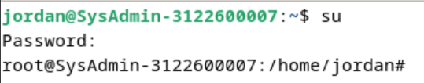

```
{
    Nama    : Agung Dwi Nugroho
    NRP     : 3122600006
    Kelas   : 2 STr IT A
}
```

# Perbedaan Command su dan su -
`su` merupakan singkatan dari *substitute user* adalah command Linux yang digunakan untuk berganti user pada saat sesi login. Pada umumnya `su` sering disalah artikan sebagai singkatan dari *super user*.<br>
Dikarenakan memang command tersebut bisa digunakan untuk mendapatkan privilege *superuser*. Ketika `su` diexecute tanpa username, maka otomatis akan menjadi *superuser* setelah memasukkan root password yang benar. Setelahnya, pengguna akan memasuki default environment root seperti pada contoh dibawah: <br>
 <br>

### Command su
Dengan menjalankan command `su`, pengguna akan dipindahkan ke akun lain yang diinginkan. Dan jika tidak menyebutkan akun yg dituju, maka pengguna diarahkan ke akun root secara default seperti yang sudah dijelaskan sebelumnya. <br>
`su` melakukan switch akun yang digunakan tanpa menjalankan login shell, dan variabel environment yang terdapat pada current user tidak akan berubah. <br>
> **Note**: Untuk berganti akun, pengguna harus mengetahui password dari akun yang akan digunakan

### Command su -
Tidak seperti command `su`, command `su -` akan memindahkan pengguna ke akun yang dituju sekaligus mengganti values pada environment variabel ke values yang terdapat pada current working environment. Dan semua environment variable yang menjadi milik main user akan dihapus. <br>
`su -` merupakan cara terbaik yg digunakan untuk mengkonfigurasi environment variable secara total. Selain itu, command `su -l` dan `su -login` memiliki kegunaan atau behaviour yang sama dengan `su -`.

### Environment Variables
Environment variables pada Linux merupakan sekumpulan dynamic values yang mendeskripsikan karakteristik dari environment yg digunakan untuk execute proses shell. Selain itu, environment variables juga mempengaruhi konfigurasi dan kustomisasi dari behavior OS serta beberapa program lainnya. Values ini digunakan untuk menentukan default paths, mengatur parameter sistem, mengatur prioritas, dan sebagainya. <br>
Environment variables berisi informasi tentang pengaturan user, pengaturan sistem, dan data yang terkait dengan OS. Dikarenakan variable-variable yang ada masih bagian dari environment shell, makauser dapat mengakses variable tersebut melalui suatu program atau proses dan menggantinya.

### Kesimpulan
Singkatnya, command `su` digunakan untuk berpindah akun dengan tetap mempertahankan current user environment variables. Sedangkan command `su -` mengexecute login shell untuk berganti akun dan secara umum merubah environment variables yang terdapat pada current user. <br>

> Terima Kasih.