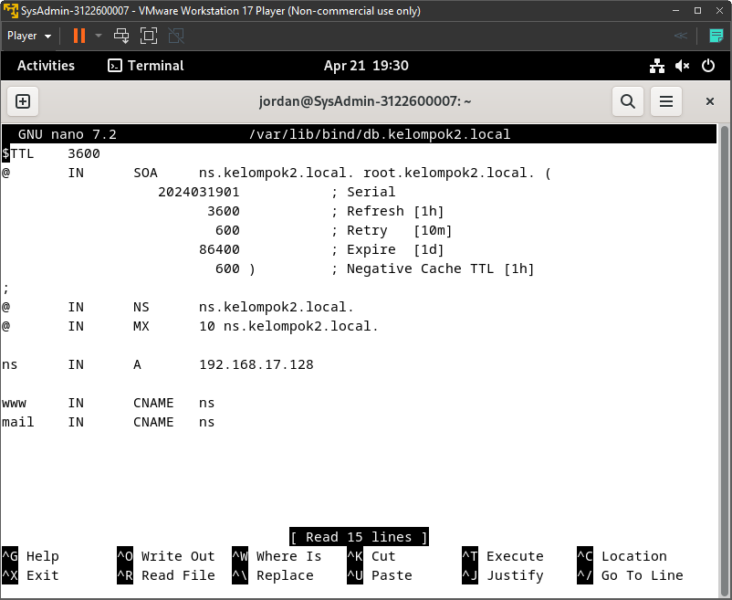

```
{
    Nama    : Agung Dwi Nugroho
    NRP     : 3122600006
    Kelas   : 2 STr IT A
}
```

# Setup DNS Server Dengan Bind9

### Step 1: Instalasi Bind9
1. Buka terminal.
2. Update paket sistem:
   ```bash
   $ sudo apt update
   $ sudo apt upgrade
   ```
3. Install BIND9:
   ```bash
   $ sudo apt install bind9 bind9-dnsutils bind9-doc
   ```

### Step 2: Konfigurasi Bind9
1. Edit file `/etc/bind/named.conf` :

   ```bash
   $ sudo nano /etc/bind/named.conf
   ```
    <div align="center">
    
    <p><strong>Gambar 1:</strong> named.conf</p>
    </div>

2. Edit file `/etc/bind/named.conf.options` :

   ```bash
   $ sudo nano /etc/bind/named.conf.options
   ```
    <div align="center">
    
    <p><strong>Gambar 2:</strong> named.conf.options</p>
    </div>

3. Edit file `/etc/bind/named.conf.local` :

   ```bash
   $ sudo nano /etc/bind/named.conf.local
   ```
    <div align="center">
    
    <p><strong>Gambar 3:</strong> named.conf.local</p>
    </div>

4. Edit file `/var/lib/bind/db.kelompok2.local` :

   ```bash
   $ sudo nano /var/lib/bind/db.kelompok2.local
   ```
    <div align="center">
    
    <p><strong>Gambar 4:</strong> db.kelompok2.local</p>
    </div>

5. Edit file `/var/lib/bind/db.kelompok2.local.inv` :

   ```bash
   $ sudo nano /var/lib/bind/db.kelompok2.local.inv
   ```
    <div align="center">
    
    <p><strong>Gambar 5:</strong> db.kelompok2.local.inv</p>
    </div>

6. Edit file `/etc/resolv.conf` :

   ```bash
   $ sudo nano /etc/resolv.conf
   ```
    <div align="center">
    
    <p><strong>Gambar 6:</strong> resolv.conf</p>
    </div>

### Step 3: Cek Konfigurasi dan Restart
1. Periksa kesalahan konfigurasi:

   ```bash
   $ sudo named-checkconf /etc/bind/named.conf
   $ sudo named-checkzone kelompok2.local /var/lib/bind/db.kelompok2.local
   $ sudo named-checkzone 17.168.192.inaddr-arpa /var/lib/bind/db.kelompok2.local.inv
   ```

2. Restart Bind9:

   ```bash
   $ sudo systemctl restart bind9
   ```

3. Periksa status Bind9:

   ```bash
   $ sudo systemctl status bind9
   ```
    <div align="center">
    
    <p><strong>Gambar 7:</strong> systemctl status</p>
    </div>

### Step 4: Tes
1. Menggunakan command `dig`:
   ```bash
   $ dig kelompok2.local
   ```
    <div align="center">
    
    <p><strong>Gambar 8:</strong> dig</p>
    </div>

2. Menggunakan command `nslookup`:
   ```bash
   $ nslookup ns
   ```
    <div align="center">
    
    <p><strong>Gambar 9:</strong> nslookup</p>
    </div>

> Terima Kasih