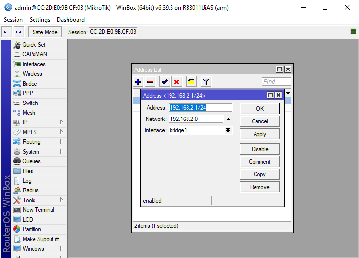
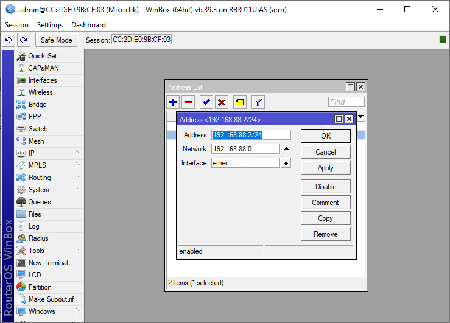
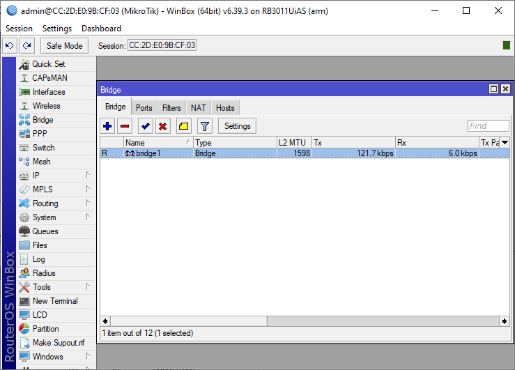
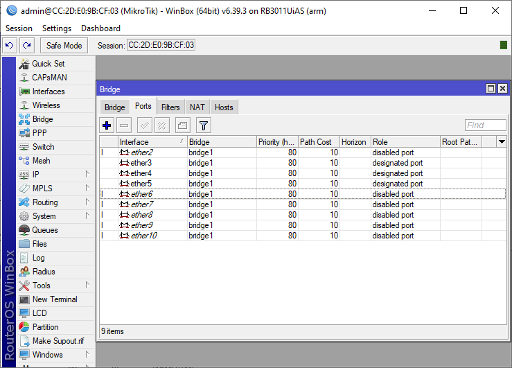
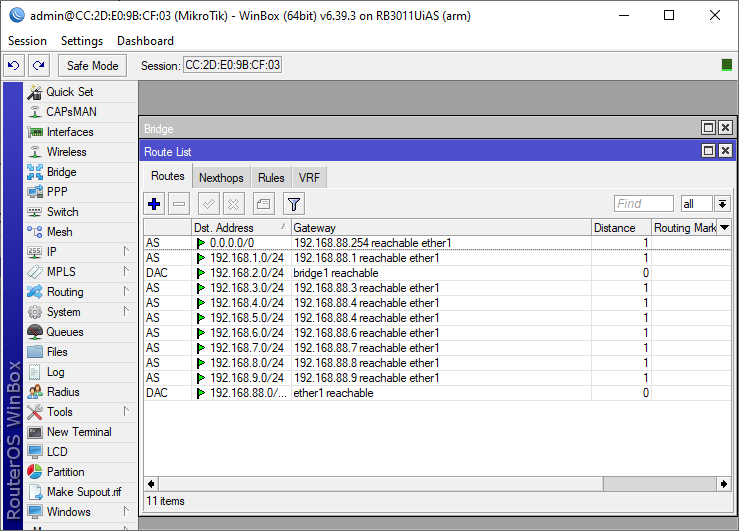
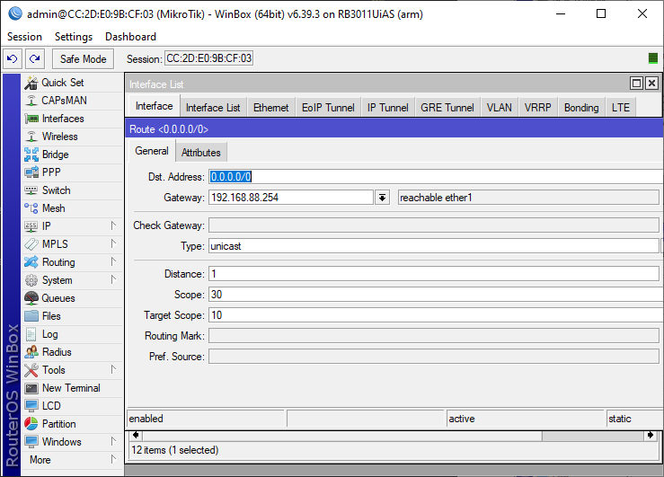

```
{
    Nama    : Agung Dwi Nugroho
    NRP     : 3122600006
    Kelas   : 2 STr IT A
}
```

# Konfigurasi MikroTik, DNS Server, Web Server, dan Email Server

### MikroTik

 1. Set Own Adrress Address for Router and for the router above it
    
    

2. Add & Set Bridge
    
    

3. Set Other Address
    to set each other Address we need to add in route lists :
    

    this 0.0.0.0 is to connect out microtik to internet. this is example to setting to configure it :
    

### DNS Server

