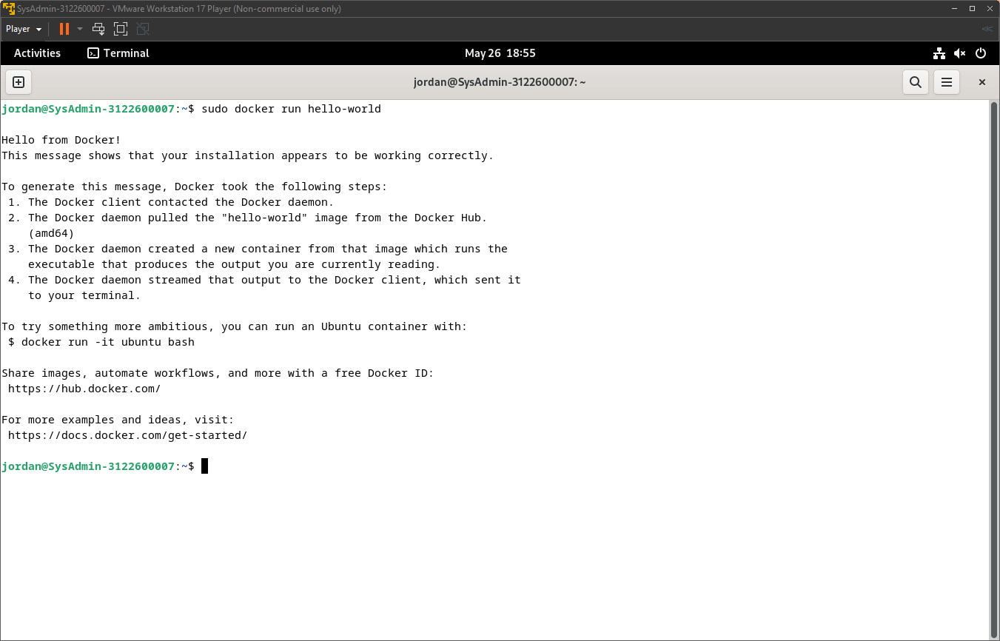

```
{
    Nama    : Agung Dwi Nugroho
    NRP     : 3122600006
    Kelas   : 2 STr IT A
}
```

# Instalasi Docker Engine Pada Debian 12

### Step 1: Membersihkan conflicting package
1. Buka terminal.
2. Jalankan command:
   ```bash
   $ for pkg in docker.io docker-doc docker-compose podman-docker containerd runc; do sudo apt-get remove $pkg; done
   ```

### Step 2: Instalasi versi terbaru Docker menggunakan apt repository
1. Buka terminal.
2. Jalankan command:
   ```bash
   $ sudo apt-get install docker-ce docker-ce-cli containerd.io docker-buildx-plugin docker-compose-plugin
   ```

### Step 3: Check hasil instalasi
1. Buka terminal.
2. Jalankan command:
   ```bash
   $ sudo docker run hello-world
   ```
3. Jika berhasil, maka akan keluar output yang menginformasikan bahwa instalasi berhasil
    <div align="center">
        
        <p><strong>Gambar 1:</strong> Docker terinstall</p>
    </div>

> Terima kasih