# INSTALASI DEBIAN 12
 
 

**1. Siapkan Partition di disk**
##
Partition digunakan untuk menyiapkan penyimpanan untuk menyimpan OS Debian, disini saya mengosongkan 40 GB untuk penyimpanan OS Debian saya
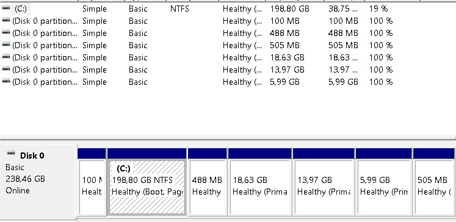

##
**2. Masuk ke BIOS Untuk menyeting prioritas boot**
##
Setiap PC memiliki akses ke BIOS seperti di laptop saya menggunakan *F10* untuk masuk ke mode BIOS setelah itu kita atur prioritas boot ke ke USB bootable kita
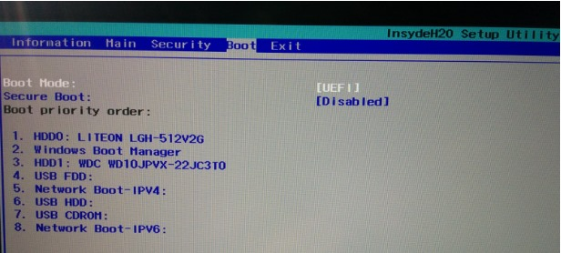
##
Setelah selesai simpan dan keluar dari mode BIOS, lalu restart PC anda lalu masuk ke instalasi Debian 12

**3. Pilih Bahasa yang digunakan di OS Debian**
##
Disini saya memilih bahasa yang digunakan di OS saya menggunakan bahasa English
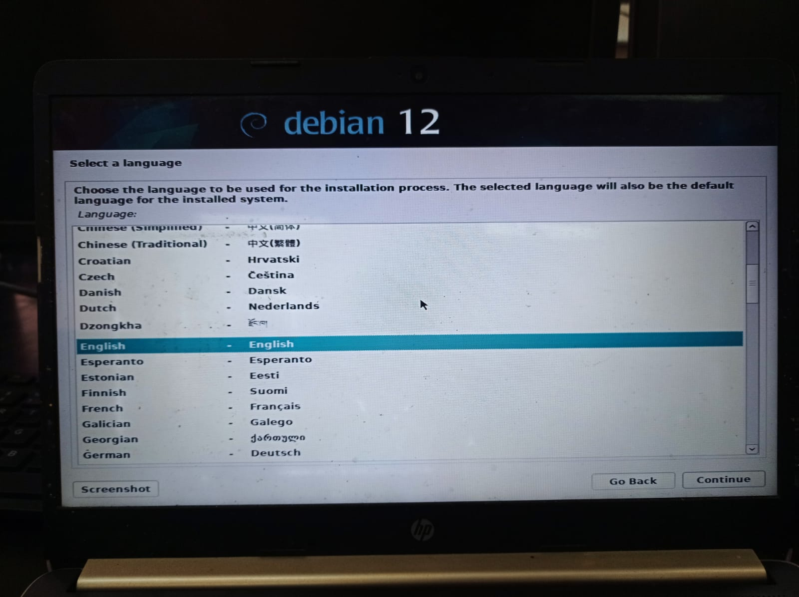

 

**4. Pilih Lokasi Anda**
##
Saya menggunakan Lokasi yang terdekat yang ada di daerah saya
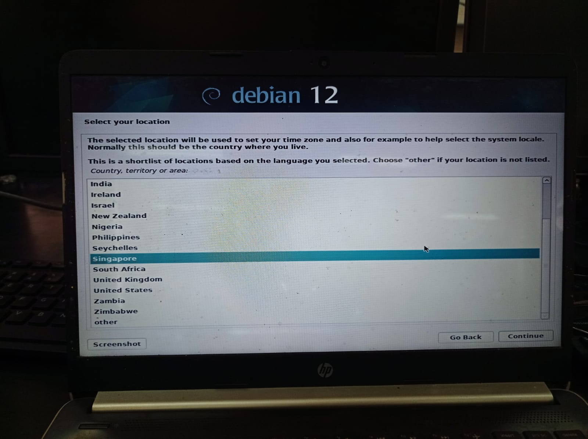
 
**5. Atur Keymap yang ingin dipakai**
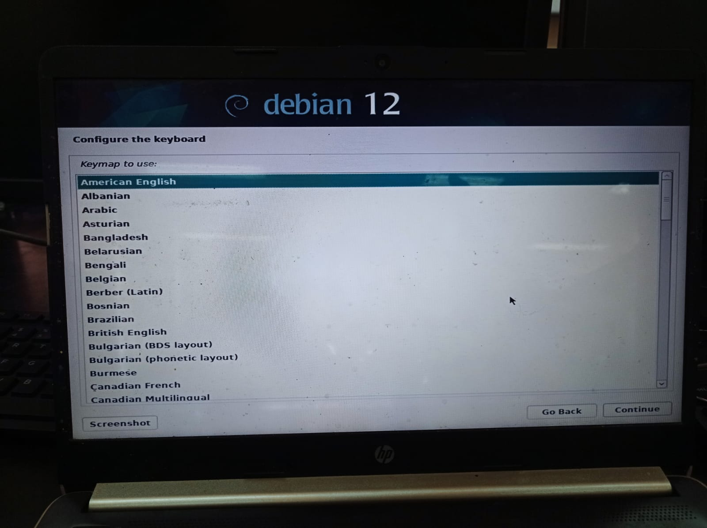
 

**5. Configure Network anda**
##
Configurasi network ini digunakan untuk koneksi untuk menginstalasi debian pada saat installasi debian
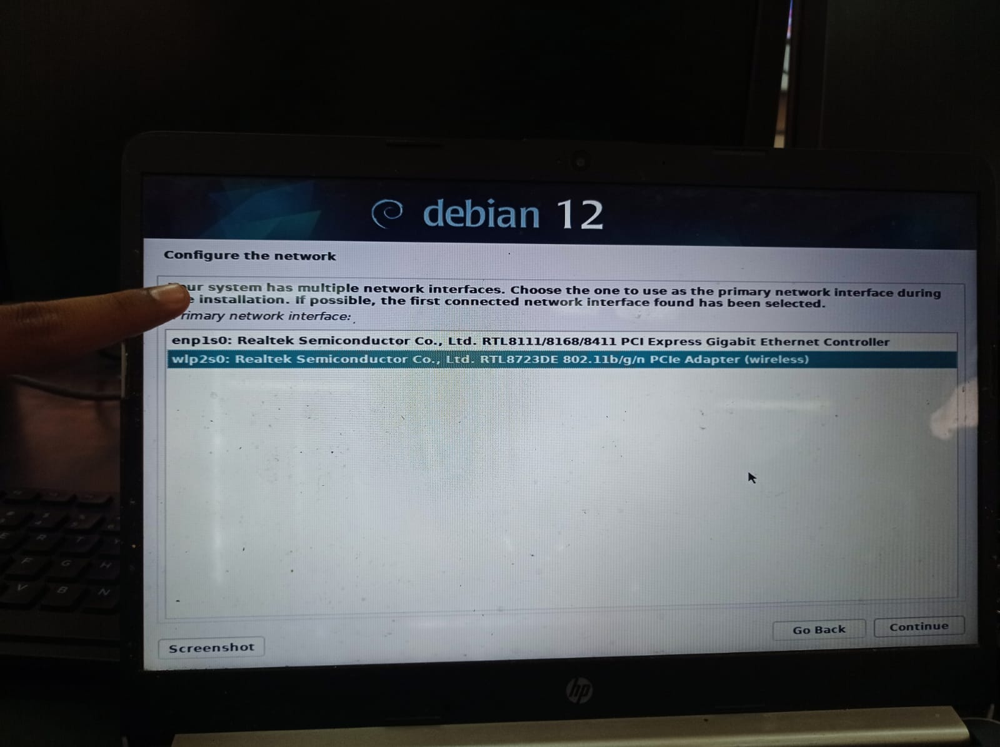

 

**6. Atur Hostname**
##
Pilih Hostname yang ingin anda gunakan
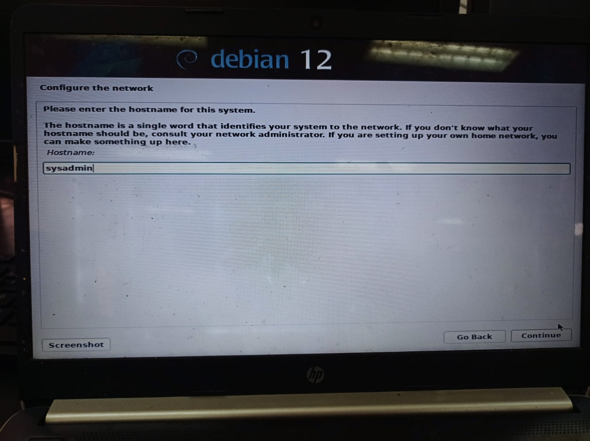

 

**7. Atur Password yang akan digunakan**
##
Untuk password anda bebas menggunakan apa saja
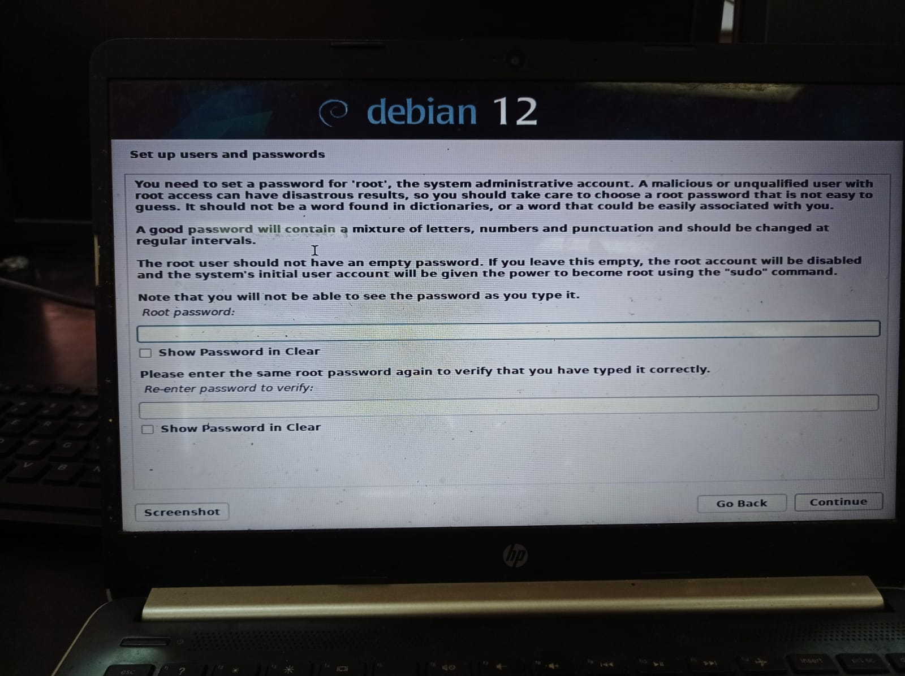

 

**8. Mengatur Partition Disk**
##
Kita memecah lagi untuk partition yang di partisi tadi dengan 3 partisi yaitu */ (untuk root)*, */storage (untuk penyimpanan) * dan *swap (untuk swap area)*
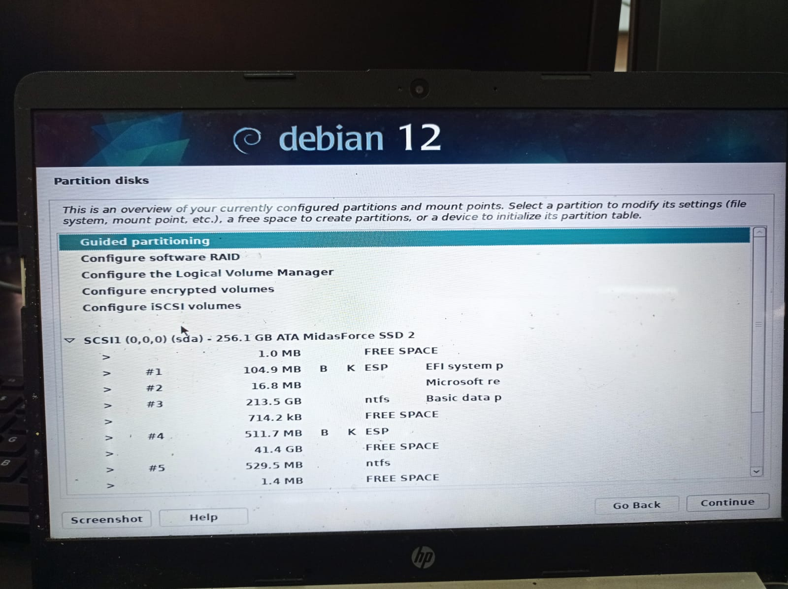
 
setelah itu change partition yang sudah kita atur
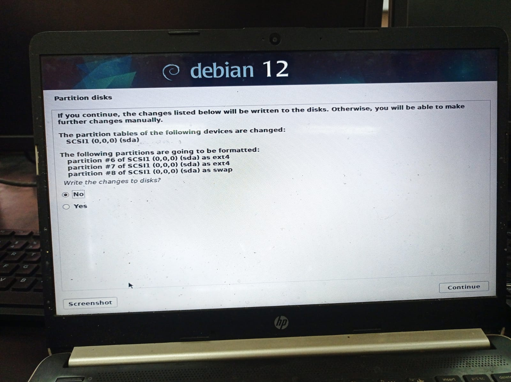
 

**9. Configure Package Manager**
##
Maksud sini kita mengatur package manager untuk memilih settingan atau template yang digunakan di OS debian 
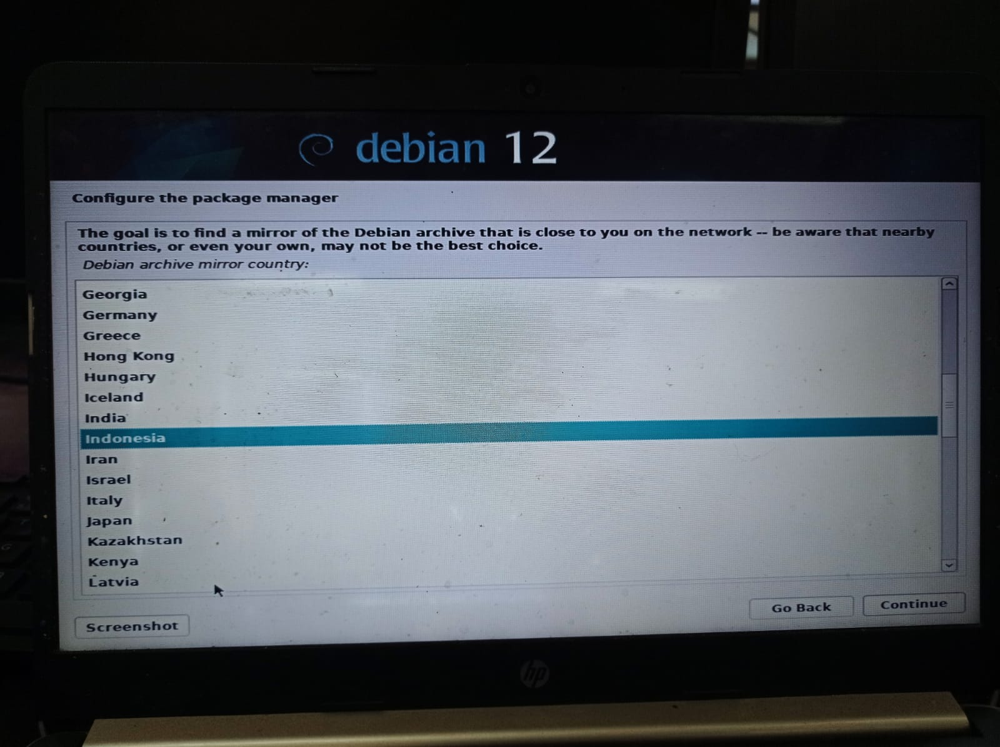

 

**10. Pilih Package Manager yang ada di Indonesia**
##
Disini saya memilih kebo.pens.ac.id 
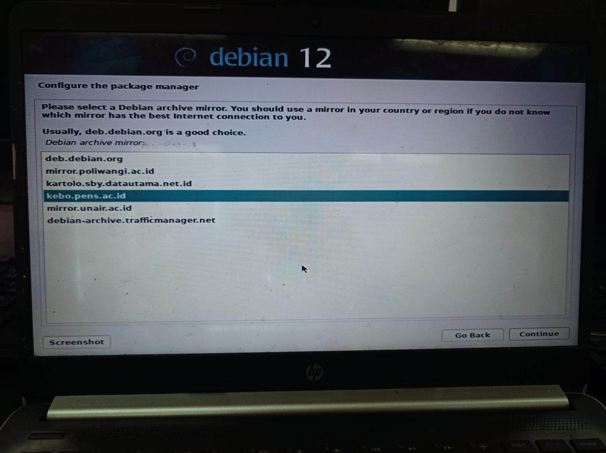

 

**11. Pilih HTTP Proxy**
##
Saya mengosongkan HTTP proxy untuk download Pakcage Manager ini
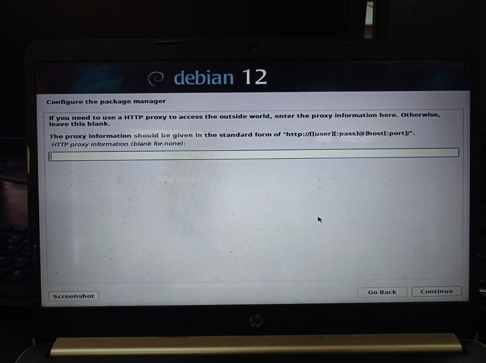

 

**12. Pilih Software yang akan di install dari package kebo**
##
Gunakan settingan default yang ada pada kebo pens
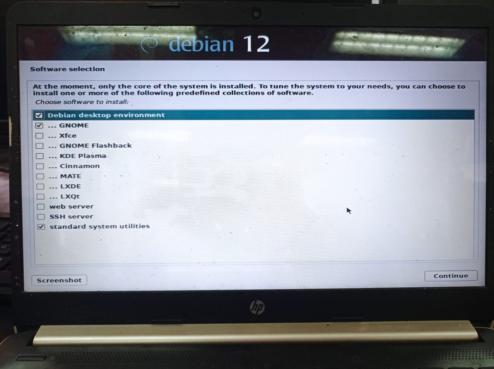

 
Setelah selesai langsung click *continuous* untuk melanjutkan sampai instalasi selesai

##
## Selamat OS Debian dengan Dualboot sudah terinstall di PC anda
 
 

Artikel ini dibuat untuk memenuhi matakuliah administrasi jaringan yang diampu oleh Bapak Ferry Astika

